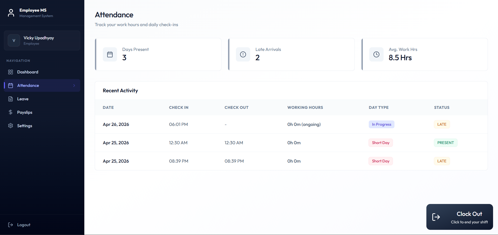
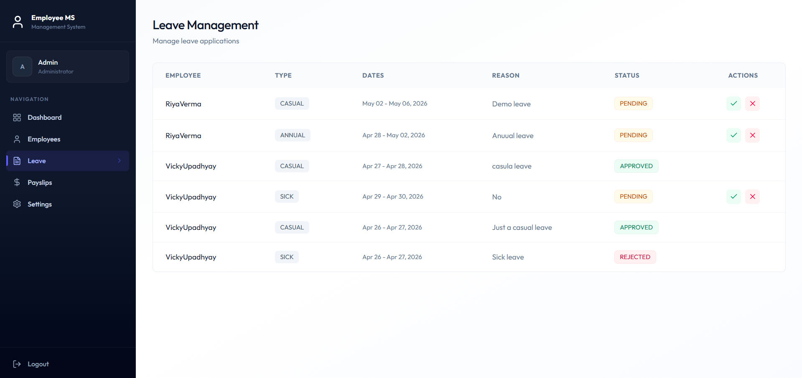

# 🚀 EMS — Employee Management System


• Developed a full-stack Employee Management System with role-based access (Admin/Employee), handling employee lifecycle, attendance tracking, leave workflows, and payroll generation

• Designed and implemented RESTful APIs using Express and MongoDB, with secure JWT-based authentication and modular architecture (routes → controllers → models)

• Integrated event-driven workflows using Inngest for automated reminders (attendance, leave approvals), improving system automation and real-world applicability

---

## 🌐 Live Demo

👉 https://aarshems.vercel.app/

### Demo Credentials

**Admin**
- Email: admin@gmail.com  
- Password: Admin@1234  

**Employee**
- Email: vicky@gmail.com  
- Password: Vicky@1234    

---

## ✨ Why This Project Stands Out

- Implements **role-based product architecture** (Admin vs Employee systems)
- Handles **real HR workflows**, not just static CRUD
- Integrates **event-driven automation (Inngest)** for background jobs
- Demonstrates **end-to-end ownership**: UI → API → DB → workflows
- Built with **modern tooling (React 19, Vite 8, Express 5)**

---

## 🧠 Core Features

### 🔐 Authentication & Access Control
- JWT-based authentication
- Role-based route protection (Admin / Employee)
- Secure session validation & password updates

---

### 👥 Employee Management
- Admin-controlled employee lifecycle
- Soft deletion & employment status tracking
- Linked user-account + employee profile system

---

### 🕒 Attendance System
- Unified clock-in / clock-out API
- Automatic working hours calculation
- Smart attendance status classification
- Background reminders for missed checkout

---

### 📝 Leave Management
- Employee leave request workflow
- Admin approval/rejection system
- Automated reminders for pending approvals

---

### 💰 Payslip System
- Admin-generated payslips with computed salary breakdown
- Role-based access to payslip history
- Dedicated printable payslip view

---

### 📊 Dashboard & Insights
- Admin analytics (employees, attendance, leave)
- Employee dashboard (activity + latest payslip)

---

### ⚙️ Automation & Background Jobs
- Event-driven workflows using Inngest:
  - Auto checkout handling
  - Leave approval reminders
  - Daily attendance alerts
- Email notifications via Nodemailer

---

## 📸 Screenshots

### 🔐 Login Page
<p align="center">
  
</p>

> Secure login system with role-based authentication for Admin and Employee users.

---

### 🕒 Attendance (Employee)
<p align="center">
  
</p>

> Employee attendance interface with clock-in/clock-out functionality and working hours tracking.

---

### 📝 Leave Management (Admin)
<p align="center">
  
</p>

> Admin view to approve or reject employee leave requests with real-time status updates.

---

### 🏠 Dashboard
<p align="center">
  
</p>

> Overview of system metrics, employee stats, attendance summary, and pending requests.

---

### 👥 Admin Panel (Employee Management)
<p align="center">
  
</p>

> Admin interface to manage employees, including search, filtering, and soft deletion.

---

### 💰 Payslip View
<p align="center">
  
</p>

> Detailed payslip with salary breakdown including basic salary, allowances, deductions, and net salary.

---

## 🛠️ Tech Stack

### Frontend
- React 19
- Vite 8
- Tailwind CSS 4
- React Router 7
- Axios
- React Hot Toast
- Lucide React
- date-fns

### Backend
- Node.js (ESM)
- Express 5
- MongoDB + Mongoose
- JWT (jsonwebtoken)
- bcrypt
- Multer
- Inngest (event workflows)
- Nodemailer

---

## Folder Structure

```text
EMS/
├── client/
│   ├── public/
│   ├── src/
│   │   ├── api/
│   │   ├── assets/
│   │   ├── components/
│   │   ├── context/
│   │   ├── pages/
│   │   ├── App.jsx
│   │   └── main.jsx
│   ├── package.json
│   └── vite.config.js
│
├── server/
│   ├── config/
│   ├── constants/
│   ├── controllers/
│   ├── inngest/
│   ├── middleware/
│   ├── models/
│   ├── routes/
│   ├── seed.js
│   ├── server.js
│   └── package.json
│
└── README.md
```

---

## 🏗️ System Architecture

QuickEMS follows a layered architecture separating frontend, backend, and async workflows.

---

### 🔄 Flow

Client (React)  
↓  
Routes (Express)  
↓  
Controllers (Business Logic)  
↓  
Database (MongoDB)  
↓  
Async Jobs (Inngest)

---

### 🚧 Future Improvements

- Role hierarchy (HR / Manager roles)
- Advanced analytics dashboard
